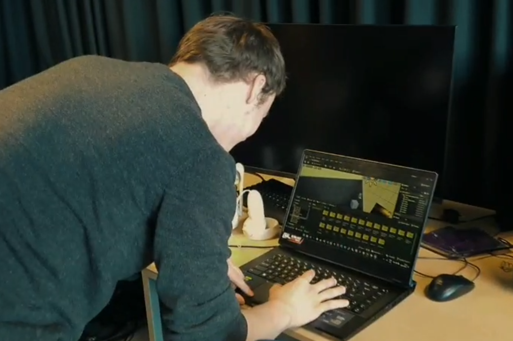

# MotusVR
<table>
  <tr>
    <td width="500">
      
    </td>
    <td>
      

        <strong>Summary</strong> 
        My experience with MotusVR taught me so much about project management, teamwork, design and user experience. I gained significant experience in user-centered product design, particularly for specialized user groups with reduced mobility. I honed my skills in gathering and analyzing requirements, using tools like UML diagrams to translate initial concepts into detailed specifications. I also learned the value of iterative design and rapid prototyping, constantly refining our game based on testing and feedback.
      

    </td>
  </tr>
</table>

<table>
  <tr>
    <td>
      

        <strong>My role as Git Administrator</strong> 
As Git admin, I ensured all project content was correctly formatted and thoroughly reviewed before merging to maintain code integrity. This involved managing the central codebase and resolving merge conflicts. My role taught me the critical importance of pre-integration quality control and seamless team collaboration, particularly when dealing with large project files and bug fixing. Naturally, A large part of my role was coding the mechanics and assissting people when they were stuck. I feel proud on my performance on adapting quickly to use the tool unreal engine and being able to assist my teammates when needed.
      

    </td>
    <td width="500">
      
    </td>
  </tr>
</table>

<table>
  <tr>
    <td align="center">
       
      Prototype 1
    </td>
    <td align="center">
       
      Prototype 2
    </td>
    <td align="center">
       
      Final Design
    </td>
  </tr>
</table>

Skills I Learned
User-Centered Design: Focused on accessibility, customization, and ease of use to meet the needs of users with reduced mobility in care settings.

Requirements Gathering & Analysis: Conducted textual analysis, identified actors/use cases, and created activity/sequence diagrams to refine project specifications.

Prototyping & Iterative Design: Used rapid prototyping and playtesting to continuously refine game design and functionality.

UI Design: Simplified menu structures, enhanced readability, and improved visual accessibility through user-informed layout decisions.

Communication & Collaboration: Practiced clear communication through team meetings, paired programming, and design justification discussions.

Problem-Solving & Adaptation: Overcame technical challenges (e.g., Unreal Engine access, performance issues) with creative solutions like asset optimization.

User Testing & Feedback Integration: Actively gathered and applied user feedback to improve gameplay, accessibility, and level design.
